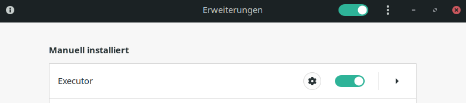

# Executor
Executes arbitrary shell commands periodically and displays the result in gnome status bar. 

The inital intention was to use it with psuinfo for example, so you get an easy way to monitor your system usage. Psuinfo needs to be manually installed in this case:

Command and interval can be set in the preferences window.

