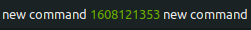

# **Executor - Gnome Shell Extension**


Execute multiple shell commands periodically with separate intervals and display the output in gnome top bar.


<br/><br/>

# **Installation**

## **One click installation**

[](https://extensions.gnome.org/extension/2932/executor/)


## **Manual installation**

- Download the file `executor@raujonas.github.io` <a href="https://github.com/raujonas/executor/releases/latest">from the latest release</a>  and extract the content to `~/.local/share/gnome-shell/extensions/executor@raujonas.github.io`.

- OR checkout the repo to `~/.local/share/gnome-shell/extensions/executor@raujonas.github.io`.
    ```
    git clone https://github.com/raujonas/executor.git ~/.local/share/gnome-shell/extensions/executor@raujonas.github.io/
    ```
With both options you have to restart gnome shell afterwards (`Alt + F2` and then enter `r`).

<br/><br/>

# **Configuration**

## **Basic**

The commands and the interval for each command can be set for each location (left, center, right) separately in the settings view.


<br/><br/>

## **Use of custom css**

It is possible to use custom css to style the output of your commands dynamically. There are two ways to do this:
- **Preferred option**: Create the file `~/.config/executor@raujonas.github.io/custom.css` and add your custom css there. This file will be imported into the extension. **This way your custom css will NOT be overwritten by extension updates**. You can use the following commands to create the file:

    ```console
    mkdir /home/$USER/.config/executor@raujonas.github.io

    touch /home/$USER/.config/executor@raujonas.github.io/custom.css
    ```
- **Non durable option**: You can add your custom css in `~/.local/share/gnome-shell/extensions/executor@raujonas.github.io/custom.css`. **Your custom css will be overwritten by extension updates in this case**. Make sure to save it somewhere before updating.

Example `custom.css` file:

```css
.red {
    color: red;
}

.yellow {
    color: yellow
}

.green {
    color: rgb(107, 179, 0);
}

.huge-font {
    font: 20px "Comic Sans";
}

.italic {
    font: 17px "Arial";
    font-style: italic;
}
```

**Note**: After making changes in your css you have to restart your shell (`Alt + F2` and then enter `r`).

**Usage**: To use the css classes dynamically in your commands, you can add it with the following syntax to your output: **`<executor.css.red>`**. This will add the specified css class to your output, in this case `red`.

**Example**: The following command queries the current timestamp. If the output is a round number it should have the color red, if not then green.

```console
date +%s | awk '{if ($1 % 2 == 0) {print $1"<executor.css.red>"} else { print $1"<executor.css.green>"} }'
```

The output is either one of the following depending on the timestamp:




You can also combine multiple css classes:


<br/><br/>

## **Use of markup**

**Usage**: To use markup there's another settings **`<executor.markup.true>`** which has to be included somewhere in the output to activate markup. 

**Example**: The following command is an example for using markup with different colors and some italic text, all inside one command. You can find other attributes like `font_family` or `size` [here](https://developer.gnome.org/pygtk/stable/pango-markup-language.html).

```
echo "<executor.markup.true> <span foreground='blue'>Blue text</span> is <i>cool</i>! <span foreground='red'>Red text</span> is cool too"
```
This produces the following output:


**Note**: Due to a [bug](https://gitlab.gnome.org/GNOME/mutter/-/issues/1324) in ClutterText there is an empty space in front of the first `<span>` tag required 

<br/><br/>

## **Combine css and markup**

Combination of css and markup is also possible. In this case the setting for markup **`<executor.markup.true>`**  must be located after all css settings. Here is an example:

```
echo " <span font_family='monospace' foreground='blue'>Blue text</span> is <i>cool</i>! <span foreground='red'>Red text</span><executor.css.green><executor.markup.true> is cool too"
```

This produces the following output:


<br/><br/>

## **More complex scripts**

If you want to execute more complex scripts it might be helpful to store them outside of the extension and create the final output there. 

[Here](https://github.com/raujonas/executor/issues/31#issue-902528380) is a very good example of how you can achieve this. With this solution it is also possible to create a rotating output of multiple different commands.

<br/><br/>

# **Export and import settings**

If you want to export and import all settings at once you can use dconf.

Export: `dconf dump /org/gnome/shell/extensions/executor/ > executor-settings.dconf`

Import: `dconf load /org/gnome/shell/extensions/executor/ < executor-settings.dconf`

<br/><br/>

# **Use cases**
Let me know what your use cases are and I will add them here.

I for example use this extension for hardware monitoring:


<br/><br/>

# **Debugging**

If you have no output or other issues you can have a look into the log:
```console
journalctl /usr/bin/gnome-shell -f
``` 

<br/><br/>

# **Development**

Please feel free to contribute and suggest ideas or report bugs!
