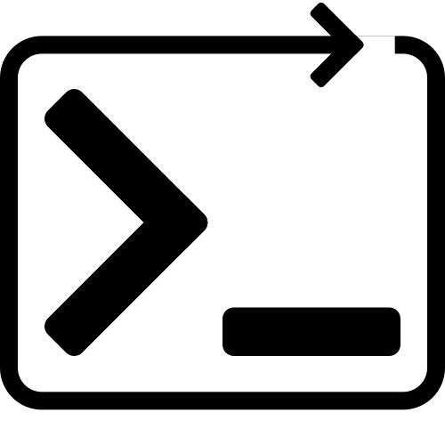
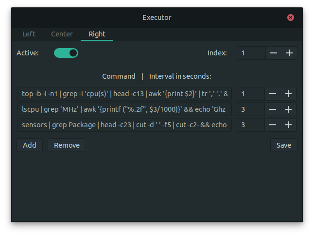

# Executor - Gnome Shell Extension


Execute arbitrary shell commands periodically and independent from each other with an individual interval and display the output in gnome top bar.


## Install

[](https://extensions.gnome.org/extension/2932/executor/)

OR download the <a href="https://github.com/raujonas/executor/releases/latest">zip of the latest release</a> and extract the content to ~/.local/share/gnome-shell/extensions/executor@raujonas.github.io

OR for **latest stable version**: checkout the repo (master branch) to ~/.local/share/gnome-shell/extensions/ and rename the project folder to /executor@raujonas.github.io

## Configuration

The commands and the interval for each command can be set for each location (left, center, right) separately in the settings view.



## Debugging

If you have no output or other issues you can usually have a look into the log with 
```console
user@system:~$ journalctl /usr/bin/gnome-shell -f
``` 

## Development

Please feel free to contribute and suggest ideas or report bugs.

Special thanks for testing and your valuable input and ideas to make this extensions even better:\
[@mrsnl](https://github.com/mrsnl) [@peterrus](https://github.com/peterrus)
